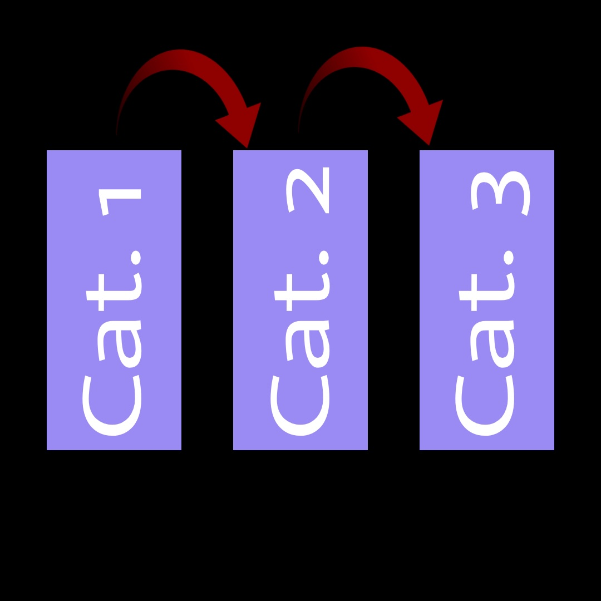

# Landscape-Analysis
The purpose of this project is to survey and compare existing work on physical modeling synthesis as it applies to what we call eco-geological sound, which is the combined domain of ecological sounds (those produced by living organisms and their environments) and geological sounds (those produced by the earth). We divided our sources into three categories corresponding to the stages of our research: open-source tools we could build with, other physical modeling projects for inspiration, and different avenues of eco-geological sound to explore. Working through these stages helped us find direction for our own project. This repository contains a visual aid explaining our research process, and our shared Overleaf document where we describe each of our sources and include a bibliography for citations.

# Visual Aid
This waterfall diagram illustrates our sequential approach through the 3 categories of our research.

